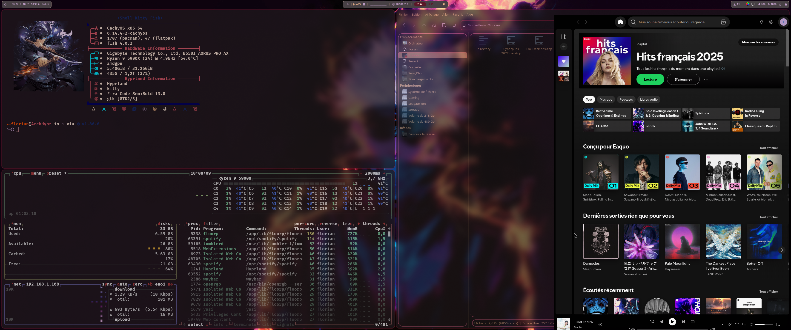

# 🌿 Hyprland Dotfiles – Arch Linux Setup

Welcome to my personal dotfiles for a customized Arch Linux system using **Hyprland** as the Wayland compositor.
This repository contains configuration files for various applications that make up my minimalist and responsive Linux desktop environment.

---

## 🖼️ Preview


---

## 📦 Included Configurations
This repository includes configuration files for the following applications:
```bash
.config/
├── Ags        # Aylur's GTK Shell
├── btop       # Resource monitor
├── cava       # Audio visualizer
├── fish       # Shell
├── hypr       # Hyprland WM
├── kitty      # Terminal
├── mpvlock    # MPV screen locker
├── neofetch   # System info tool
├── nvim       # Neovim editor
├── rofi       # Application launcher
├── rofi-games # Extension for launching games with Rofi
├── spicetify  # Spotify customization
├── swaync     # Notification center
├── swappy     # Screenshot annotation tool
├── wallust    # Color scheme manager
├── waybar     # Status bar for Wayland
└── wezterm    # Terminal
```

---

## 🚀 Rofi - Application Launcher and More

### Application Launcher and Ags
My Rofi launcher is customized to integrate seamlessly with my overall theme. It offers a clean and responsive interface for launching your favorite applications.

<div align="center">
  
  <p><em>Rofi Application Launcher</em></p>
</div>

<div align="center">
  
  <p><em>Aylur's GTK Shell (Ags)</em></p>
</div>

Special thanks to [JaKooLit](https://github.com/JaKooLit) for the inspiration.

### Wallpaper Selector
I created a custom wallpaper selector with Rofi that allows you to easily choose and apply wallpapers from a visual interface.

<div align="center">
  
  <p><em>Rofi Wallpaper Selector</em></p>
</div>

#### Using the wallpaper selector:
- **Keyboard shortcut**: `Mod+W` (Mod = Super = Windows Key)
- **Features**:
  - Random wallpaper selection
  - Multi-workspace wallpaper support
  - Special effects for wallpapers
  - MPVpaper for video wallpapers

#### Wallpaper locations:
- **Static wallpapers**: `~/Pictures/wallpapers/`
- **Video wallpapers**: `~/Pictures/wallpapers/Video/`

---

## 🎨 Wallust - Dynamic Themes

Wallust automatically manages my color schemes based on the current wallpaper, creating a cohesive visual experience across the entire system.

### GTK & Thunar Integration
My setup uses a custom GTK configuration based on the [phocus/gtk](https://github.com/phocus/gtk) project that makes Thunar (and all other GTK applications) automatically adapt to the color scheme generated by Wallust.

<div align="center">
  
  <p><em>Thunar file manager with Wallust theme integration</em></p>
</div>

#### Dynamic theme examples:
<div align="center">
  
  <p><em>Theme example 1</em></p>
</div>

<div align="center">
  
  <p><em>Theme example 2 - Notice how colors automatically change</em></p>
</div>

#### How it works:
1. Wallust extracts a color palette from the current wallpaper
2. The phocus/gtk theme reads these colors from Wallust's configuration
3. GTK applications like Thunar automatically adapt their appearance to match the system theme

#### Setup:
1. Install the phocus/gtk theme in `.themes/gtk`
2. Configure Wallust to generate color variables in the format expected by phocus
3. Apply a new wallpaper using the Rofi wallpaper selector (Mod+W)
4. Wallust automatically regenerates the theme based on the new wallpaper

This creates a seamless visual experience where your file manager and other GTK applications automatically match your desktop theme.

---

## 🎮 Gaming with Custom Scripts

I developed a game launching system with preconfigured options for each game. This makes it easy to launch games with different configurations without having to manually specify them each time.

### Features
- Preferred options for each game (resolution, fullscreen, etc.)
- Optimized performance configurations
- Integration with Mangohud for in-game statistics
- Support for launchers (Steam, Lutris, etc.)

<div align="center">
  
  <p><em>Rofi Game Launcher Interface</em></p>
</div>

### Game Script Creation

<div align="center">
  
  <p><em>Game script editor</em></p>
</div>

#### Creating a new game script:
1. Run `-01-script-Game` to open the game script interface
2. Select "Create new script" (`-02`)
3. Name your script file (`-03`)
4. Edit the script settings (`-04`)

#### Example configuration (The_Finals):
```bash
GAMESCOPE_OPTIONS="False"
GAME_PERF="True"
GAME_VRR="True"
ANIMATION="True"
MANGOHUD_OPTION="True"
OPTION_AFTER="-useallavailablecores"
LANG_KEY="fr"

# ======= GENERAL SETTINGS =======
MONITOR="DP-2"
RESOLUTION="3440x1440"
REFRESH_RATE="165"
POSITION="0x0"
SCALE="1"

RES_WIDTH=3440
RES_HEIGHT=1440
FSR="True"
```

#### Applying the script:
- Run: `config/hypr/scripts/Gamescope/add_script.sh`
- OR: Select "Run update script" from the `-01-script-Game` menu

#### Using in Steam:
Add to your game's launch options:
```
The_Finals %command% # Launches The Finals with optimized settings
```

---

## 💻 Installation

### Prerequisites
```bash
sudo pacman -S hyprland kitty rofi waybar fish neovim btop cava thunar
```

### Additional dependencies
```bash
yay -S wallust spicetify-cli rofi-games-git swaync swappy aylurs-gtk-shell-git
```

---

## 🙏 Acknowledgements
- [JaKooLit](https://github.com/JaKooLit) who introduced me to and made me love Hyprland
- [Hyprland](https://github.com/hyprwm/Hyprland) for the amazing Wayland compositor
- [r/unixporn](https://reddit.com/r/unixporn) for inspiration
- All the developers of the tools used in this configuration

---

## 📜 License
This project is licensed under the MIT License - see the [LICENSE](LICENSE) file for details.